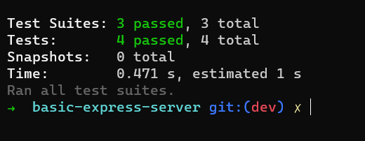

# basic-express-server

## Heroku_link 
[Here](https://basic-express-server-hamza.herokuapp.com/)

## Documentaion 
* Creating an express server contains 

1.  Two Middleware 
 * logger : applies consol.log for the requested path.
 * validator : Checks if the query string has a valid name and sends the request through when valid, forces an error when not
2.  Two erro-handlers
 * error 404 : for unavailable routes 
 * error 500 : for any syntax errror.
3.  Npm test 

 
